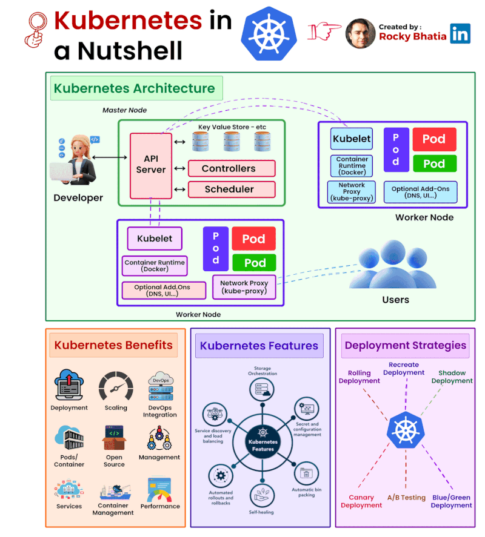

<details markdown="block">                  
<summary>                  
Table of contents                  
</summary>                  
{: .text-delta }                  
1. TOC                  
{:toc}                  
</details>                  

<br/>                  

***                  

<br/>                  

# [GitHub Linguist](https://github.com/github-linguist/linguist/blob/master/lib/linguist/languages.yml)

> Code block Syntax yml
    
---

# GitHub Styling Quirks

## visible in GitHub md page

```markdown    
> **Note**
<br/>
> This is a note    
```    

> **Note**
> <br/>
> This is a note

```markdown    
> **Warning**
<br/>
> This is a warning    
```    

> **Warning**
> <br/>
> This is a warning

## visible online

```html    
<div style="padding: 15px; border: 1px solid transparent; border-color: transparent; margin-bottom: 20px; border-radius: 4px; color: #3c763d; background-color: #dff0d8; border-color: #d6e9c6;">
    I am a success message
</div> 
```    

<div style="padding: 15px; border: 1px solid transparent; border-color: transparent; margin-bottom: 20px; border-radius: 4px; color: #3c763d; background-color: #dff0d8; border-color: #d6e9c6;">            
I am a success message                
</div>            

---

```html    
<div style="padding: 15px; border: 1px solid transparent; border-color: transparent; margin-bottom: 20px; border-radius: 4px; color: #a94442; background-color: #f2dede; border-color: #ebccd1;">
    I am an error message
</div>  
```

<div style="padding: 15px; border: 1px solid transparent; border-color: transparent; margin-bottom: 20px; border-radius: 4px; color: #a94442; background-color: #f2dede; border-color: #ebccd1;">            
I am an error message                
</div>      

---

```html    
<div style="padding: 15px; border: 1px solid transparent; border-color: transparent; margin-bottom: 20px; border-radius: 4px; color: #31708f; background-color: #d9edf7; border-color: #bce8f1;">
    I am an info message
</div>   
```    

<div style="padding: 15px; border: 1px solid transparent; border-color: transparent; margin-bottom: 20px; border-radius: 4px; color: #31708f; background-color: #d9edf7; border-color: #bce8f1;">            
I am a info message                
</div>            

---

```html    
<div style="padding: 15px; border: 1px solid transparent; border-color: transparent; margin-bottom: 20px; border-radius: 4px; color: #8a6d3b;; background-color: #fcf8e3; border-color: #faebcc;">
    I am a warning message
</div>     
```    

<div style="padding: 15px; border: 1px solid transparent; border-color: transparent; margin-bottom: 20px; border-radius: 4px; color: #8a6d3b;; background-color: #fcf8e3; border-color: #faebcc;">            
I am a warning message                
</div>        

## Adding Image

```markdown

```

```markdown

```

```html

```

```markdown

```

# [Pandoc](https://pandoc.org/demos.html)

## Add Table of Contents to mark down doc with pandoc

1) set file name

```shell                  
fileMD=CLI_Grailsw.md;                  
```                  

2) run

```shell                  
pandoc -s --toc $fileMD -o output.md; rm -f $fileMD; mv output.md ./$fileMD;                  
```                  

## docx to markdown

```shell                  
pandoc -s example30.docx --wrap=none --reference-links -t markdown -o example35.md                  
```                  

> or

  ```shell                  
  pandoc -t markdown_strict \                  
  --extract-media='./BrandonPaxton' myfilename.docx -o myfilename.md                  
  ```                  

## scripts

### convert to docx

```shell                  
#!/bin/bash                  
                    
# save input from command line                  
  input=$1                  
                    
# get filename from input                  
  filename=$(basename -s .docx $input)                  
                    
# convert word to markdown                  
  pandoc -f docx -t markdown "$input"  -o $filename.md                  
```                  

## files
      
```shell                  
#!/bin/bash                  
                   
# save current working directory to variable                  
  cwd=$(pwd)                  
                   
# find all .docx files in current directory                  
  find $cwd -name "*.docx" -type f -print0 | while IFS= read -r -d $'\0' line; do                  
                   
# remove spaces in filename                  
  ns_filename=$(echo $line | sed 's/ /_/g')                  
                   
# get filename from input                  
  the_filename=$(basename -s .docx $ns_filename)                  
                   
# convert word to markdown                  
# echo "pandoc -f docx -t markdown \"$line\" -o $the_filename.md"                  
  pandoc -f docx -t markdown "$line" -o $the_filename.md                  
  done                  
```

### Example Used

```shell                
  #!/bin/bash                
  pandoc -t markdown_strict -s BrandonPaxton.docx --wrap=none --reference-links -t markdown -o BPResume.md;
```    
