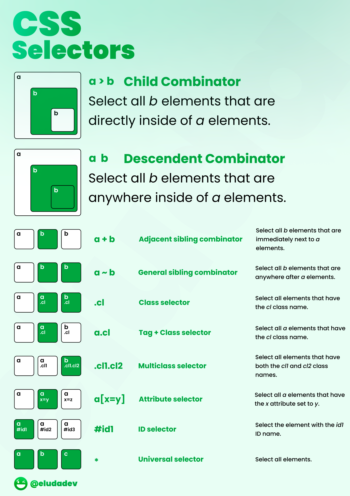

<details markdown="block">          
<summary>          
Table of contents          
</summary>          
{: .text-delta }          
1. TOC          
{:toc}          
</details>          

<br/>          

***          

<br/>     

# Selectors



# Use SVG in CSS

```css
html {
    background-image: url('data:image/jpg;base64,/9j/4RkARXhpZgAATU0AKgAAAAgAB6f/9k='), url(/TBEX/resource/src/815-teams-north-gate-path.jpg);
    background-size: cover;
    background-repeat: no-repeat;
    background-position: center;
    background-attachment: fixed;
    height: 100%;
    /*background-color: #FFFFFF; !* match backgroud to bottom of page *!*/
}
```

# Tricks

<div><div id="css-typing-effect" class="tip"><h3> * Typing Effect </h3><div class="paragraph"><p>Did you know that you can create a typing effect with zero JavaScript?</p></div><div class="pb30"><div class="cp_embed_wrapper"><iframe allowfullscreen="true" allowpaymentrequest="true" allowtransparency="true" class="cp_embed_iframe " frameborder="0" height="315" width="100%" name="cp_embed_1" scrolling="no" src="https://codepen.io/denic/embed/GRoOxbM?height=315&amp;theme-id=dark&amp;default-tab=result&amp;user=denic&amp;slug-hash=GRoOxbM&amp;pen-title=CSS%20Typing%20Effect&amp;name=cp_embed_1" style="width: 100%; overflow:hidden; display:block;" title="CSS Typing Effect" loading="lazy" id="cp_embed_GRoOxbM"></iframe></div></div></div><div id="css-drop-shadow" class="tip"><h3> * Drop shadow </h3><div class="paragraph"><p>When you work with transparent images you can use `drop-shadow()` filter function to create a shadow on the image’s content, instead of `box-shadow` property which creates a rectangular shadow behind an element’s entire box: filter:</p><p>drop-shadow(2px 4px 8px #585858);</p></div><div class="pb30"><div class="cp_embed_wrapper"><iframe allowfullscreen="true" allowpaymentrequest="true" allowtransparency="true" class="cp_embed_iframe " frameborder="0" height="420" width="100%" name="cp_embed_2" scrolling="no" src="https://codepen.io/denic/embed/MWeGqJb?height=420&amp;theme-id=dark&amp;default-tab=result&amp;user=denic&amp;slug-hash=MWeGqJb&amp;pen-title=drop-shadow&amp;name=cp_embed_2" style="width: 100%; overflow:hidden; display:block;" title="drop-shadow" loading="lazy" id="cp_embed_MWeGqJb"></iframe></div></div></div><div id="css-smooth-scroling" class="tip"><h3> * Smooth scrolling </h3><div class="paragraph"><p>Smooth scrolling without JavaScript, with just one line of CSS.</p></div><div class="pb30"><div class="cp_embed_wrapper"><iframe allowfullscreen="true" allowpaymentrequest="true" allowtransparency="true" class="cp_embed_iframe " frameborder="0" height="315" width="100%" name="cp_embed_3" scrolling="no" src="https://codepen.io/denic/embed/bGVeYqN?height=315&amp;theme-id=dark&amp;default-tab=result&amp;user=denic&amp;slug-hash=bGVeYqN&amp;pen-title=CSS%20Smooth%20Scroll&amp;name=cp_embed_3" style="width: 100%; overflow:hidden; display:block;" title="CSS Smooth Scroll" loading="lazy" id="cp_embed_bGVeYqN"></iframe></div></div></div><div id="css-center" class="tip"><h3> * Center </h3><div class="paragraph"><p>Easily center anything, horizontally and vertically, with 3 lines of <a href="https://markodenic.com/category/css/">CSS.</a><br> Explore other ways to <a href="https://markodenic.com/snippets/css/center-a-div/">center a div</a>.</p></div><div class="mb30"><div class="code-toolbar"><pre class=" language-css">           <code class=" language-css">
<span class="token selector">.center</span> <span class="token punctuation">{</span>
  <span class="token property">display</span><span class="token punctuation">:</span> flex<span class="token punctuation">;</span>
  <span class="token property">align-items</span><span class="token punctuation">:</span> center<span class="token punctuation">;</span>
  <span class="token property">justify-content</span><span class="token punctuation">:</span> center<span class="token punctuation">;</span>       
<span class="token punctuation">}</span>           </code>
    </pre><div class="toolbar"><div class="toolbar-item"><button type="button">Copy</button></div></div></div></div></div><div id="css-cursors" class="tip"><h3> * Cursors </h3><div class="paragraph"><p>Did you know that you can use your own image, or even emoji as a cursor?</p></div><div class="pb30"><div class="cp_embed_wrapper"><iframe allowfullscreen="true" allowpaymentrequest="true" allowtransparency="true" class="cp_embed_iframe " frameborder="0" height="315" width="100%" name="cp_embed_4" scrolling="no" src="https://codepen.io/denic/embed/bGVpOPj?height=315&amp;theme-id=dark&amp;default-tab=result&amp;user=denic&amp;slug-hash=bGVpOPj&amp;pen-title=Cursors&amp;name=cp_embed_4" style="width: 100%; overflow:hidden; display:block;" title="Cursors" loading="lazy" id="cp_embed_bGVpOPj"></iframe></div></div></div><div id="css-truncate-text" class="tip"><h3> * Truncate text </h3><div class="paragraph"><p>Did you know that you can truncate text with plain CSS?</p></div><div class="pb30"><div class="cp_embed_wrapper"><iframe allowfullscreen="true" allowpaymentrequest="true" allowtransparency="true" class="cp_embed_iframe " frameborder="0" height="315" width="100%" name="cp_embed_5" scrolling="no" src="https://codepen.io/denic/embed/LYpZKMg?height=315&amp;theme-id=dark&amp;default-tab=result&amp;user=denic&amp;slug-hash=LYpZKMg&amp;pen-title=Ellipsis&amp;name=cp_embed_5" style="width: 100%; overflow:hidden; display:block;" title="Ellipsis" loading="lazy" id="cp_embed_LYpZKMg"></iframe></div></div></div><div id="truncate-text-to-the-specific-number-of-lines" class="tip"><h3> * Truncate the text to the specific number of lines. </h3><div class="paragraph"><p>You can use “-webkit-line-clamp” property to truncate the text to the specific number of lines. An ellipsis will be shown at the point where the text is clamped.</p></div><div class="pb30"><div class="cp_embed_wrapper"><iframe allowfullscreen="true" allowpaymentrequest="true" allowtransparency="true" class="cp_embed_iframe " frameborder="0" height="315" width="100%" name="cp_embed_6" scrolling="no" src="https://codepen.io/denic/embed/pojEKGX?height=315&amp;theme-id=dark&amp;default-tab=result&amp;user=denic&amp;slug-hash=pojEKGX&amp;pen-title=Truncate%20the%20text%20to%20the%20specific%20number%20of%20lines%20(CSS)&amp;name=cp_embed_6" style="width: 100%; overflow:hidden; display:block;" title="Truncate the text to the specific number of lines (CSS)" loading="lazy" id="cp_embed_pojEKGX"></iframe></div></div></div><div id="css-selection-pseudo-element" class="tip"><h3> * `::selection` CSS pseudo-element </h3><div class="paragraph"><p><span class="css-901oao css-16my406 r-1qd0xha r-ad9z0x r-bcqeeo r-qvutc0">The `::selection` </span><span class="css-901oao css-16my406 r-1qd0xha r-b88u0q r-ad9z0x r-bcqeeo r-qvutc0">CSS</span><span class="css-901oao css-16my406 r-1qd0xha r-ad9z0x r-bcqeeo r-qvutc0"> pseudo-element applies styles to the part of a document that has been highlighted by the user (such as clicking and dragging the mouse across text).</span></p></div><div class="pb30"><div class="cp_embed_wrapper"><iframe allowfullscreen="true" allowpaymentrequest="true" allowtransparency="true" class="cp_embed_iframe " frameborder="0" height="315" width="100%" name="cp_embed_7" scrolling="no" src="https://codepen.io/denic/embed/LYZZQJe?height=315&amp;theme-id=dark&amp;default-tab=result&amp;user=denic&amp;slug-hash=LYZZQJe&amp;pen-title=%3A%3Aselection%20pseudo-element&amp;name=cp_embed_7" style="width: 100%; overflow:hidden; display:block;" title="::selection pseudo-element" loading="lazy" id="cp_embed_LYZZQJe"></iframe></div></div></div><div id="css-anything-resizible" class="tip"><h3> * Anything resizable </h3><div class="paragraph"><p>Did you know that you can make any element resizable, just like `&lt;textarea&gt;`?</p></div><div class="mb30"><div class="code-toolbar"><pre class=" language-css">           <code class=" language-css">
<span class="token selector">.resize</span> <span class="token punctuation">{</span>
   <span class="token property">resize</span><span class="token punctuation">:</span> both<span class="token punctuation">;</span>
<span class="token punctuation">}</span>           </code>
    </pre><div class="toolbar"><div class="toolbar-item"><button type="button">Copy</button></div></div></div></div></div><div id="css-modals" class="tip"><h3> CSS modals </h3><div class="paragraph"><p>You can use the `:target` pseudo-class to create modals with zero JavaScript.</p></div><div class="pb30"><div class="cp_embed_wrapper"><iframe allowfullscreen="true" allowpaymentrequest="true" allowtransparency="true" class="cp_embed_iframe " frameborder="0" height="315" width="100%" name="cp_embed_8" scrolling="no" src="https://codepen.io/denic/embed/ZEbKgPp?height=315&amp;theme-id=dark&amp;default-tab=result&amp;user=denic&amp;slug-hash=ZEbKgPp&amp;pen-title=CSS-only%20modal&amp;name=cp_embed_8" style="width: 100%; overflow:hidden; display:block;" title="CSS-only modal" loading="lazy" id="cp_embed_ZEbKgPp"></iframe></div></div></div><div id="css-calc" class="tip"><h3> * `calc()` </h3><div class="paragraph"><p><span class="css-901oao css-16my406 r-1qd0xha r-ad9z0x r-bcqeeo r-qvutc0">The `calc()` </span><span class="css-901oao css-16my406 r-1qd0xha r-b88u0q r-ad9z0x r-bcqeeo r-qvutc0">CSS</span><span class="css-901oao css-16my406 r-1qd0xha r-ad9z0x r-bcqeeo r-qvutc0"> function lets you perform calculations when specifying </span><span class="css-901oao css-16my406 r-1qd0xha r-b88u0q r-ad9z0x r-bcqeeo r-qvutc0">CSS</span><span class="css-901oao css-16my406 r-1qd0xha r-ad9z0x r-bcqeeo r-qvutc0"> property values:</span></p></div><div class="mb30"><div class="code-toolbar"><pre class=" language-css">           <code class=" language-css">
<span class="token selector">.calculated-width:</span> <span class="token punctuation">{</span>
    <span class="token property">width</span><span class="token punctuation">:</span> <span class="token function">calc</span><span class="token punctuation">(</span>100% - 30px<span class="token punctuation">)</span><span class="token punctuation">;</span>
<span class="token punctuation">}</span>           </code>
    </pre><div class="toolbar">
<div class="toolbar-item">
<button type="button">Copy</button></div></div></div></div></div><div id="css-style-empty-elements" class="tip"><h3> * Style empty elements </h3><div class="paragraph"><p>You can use the `:empty` selector to style an element that has no children or text at all:</p></div><div class="pb30"><div class="cp_embed_wrapper"><iframe allowfullscreen="true" allowpaymentrequest="true" allowtransparency="true" class="cp_embed_iframe " frameborder="0" height="315" width="100%" name="cp_embed_9" scrolling="no" src="https://codepen.io/denic/embed/KKMpZdP?height=315&amp;theme-id=dark&amp;default-tab=result&amp;user=denic&amp;slug-hash=KKMpZdP&amp;pen-title=CSS%20%3Aempty%20Selector&amp;name=cp_embed_9" style="width: 100%; overflow:hidden; display:block;" title="CSS :empty Selector" loading="lazy" id="cp_embed_KKMpZdP"></iframe></div></div></div><div id="css-custom-scrollbar" class="tip"><h3> * You can create a custom scrollbar </h3><div class="pb30"><div class="cp_embed_wrapper"><iframe allowfullscreen="true" allowpaymentrequest="true" allowtransparency="true" class="cp_embed_iframe " frameborder="0" height="315" width="100%" name="cp_embed_10" scrolling="no" src="https://codepen.io/denic/embed/NWrZmwV?height=315&amp;theme-id=dark&amp;default-tab=result&amp;user=denic&amp;slug-hash=NWrZmwV&amp;pen-title=Custom%20Scrollbar&amp;name=cp_embed_10" style="width: 100%; overflow:hidden; display:block;" title="Custom Scrollbar" loading="lazy" id="cp_embed_NWrZmwV"></iframe></div></div></div><div id="css-position-sticky" class="tip"><h3> * position: sticky; </h3><div class="paragraph"><p><span class="css-901oao css-16my406 r-1qd0xha r-ad9z0x r-bcqeeo r-qvutc0">You can create sticky section headers with 2 lines of </span><span class="css-901oao css-16my406 r-1qd0xha r-b88u0q r-ad9z0x r-bcqeeo r-qvutc0">CSS</span><span class="css-901oao css-16my406 r-1qd0xha r-ad9z0x r-bcqeeo r-qvutc0">.</span></p></div><div class="pb30"><div class="cp_embed_wrapper"><iframe allowfullscreen="true" allowpaymentrequest="true" allowtransparency="true" class="cp_embed_iframe " frameborder="0" height="315" width="100%" name="cp_embed_11" scrolling="no" src="https://codepen.io/denic/embed/jObYpaP?height=315&amp;theme-id=dark&amp;default-tab=result&amp;user=denic&amp;slug-hash=jObYpaP&amp;pen-title=Sticky%20Sections&amp;name=cp_embed_11" style="width: 100%; overflow:hidden; display:block;" title="Sticky Sections" loading="lazy" id="cp_embed_jObYpaP"></iframe></div></div></div><div id="css-scroll-snap" class="tip"><h3> * CSS Scroll Snap </h3><div class="paragraph"><p>You can use the CSS Scroll Snap feature to create well-controlled scroll experiences:</p></div><div class="pb30"><div class="cp_embed_wrapper"><iframe allowfullscreen="true" allowpaymentrequest="true" allowtransparency="true" class="cp_embed_iframe " frameborder="0" height="315" width="100%" name="cp_embed_12" scrolling="no" src="https://codepen.io/denic/embed/ExNZmwd?height=315&amp;theme-id=dark&amp;default-tab=result&amp;user=denic&amp;slug-hash=ExNZmwd&amp;pen-title=CSS%20Scroll%20Snap&amp;name=cp_embed_12" style="width: 100%; overflow:hidden; display:block;" title="CSS Scroll Snap" loading="lazy" id="cp_embed_ExNZmwd"></iframe></div></div></div><div id="css-dynamic-tooltips" class="tip"><h3> * Dynamic Tooltips </h3><div class="paragraph"><p>Create dynamic CSS-only tooltips, using the&nbsp;<code>attr()</code>&nbsp;CSS function.</p></div><div class="pb30"><div class="cp_embed_wrapper"><iframe allowfullscreen="true" allowpaymentrequest="true" allowtransparency="true" class="cp_embed_iframe " frameborder="0" height="315" width="100%" name="cp_embed_13" scrolling="no" src="https://codepen.io/denic/embed/zYobqqa?height=315&amp;theme-id=dark&amp;default-tab=result&amp;user=denic&amp;slug-hash=zYobqqa&amp;pen-title=CSS-only%20Tooltip&amp;name=cp_embed_13" style="width: 100%; overflow:hidden; display:block;" title="CSS-only Tooltip" loading="lazy" id="cp_embed_zYobqqa"></iframe></div></div></div><div id="css-caret-color" class="tip"><h3> * caret-color </h3><div class="paragraph"><p>You can change the color of the text input cursor.</p></div><div class="pb30"></div></div><div id="in-range-and-out-of-range-pseudo-classes" class="tip"><h3> * `::in-range` and `::out-of-range` pseudo-classes </h3><div class="paragraph"><p>Use <code>::in-range</code> and <code>::out-of-range</code> pseudo-classes to style inputs whose current value is outside the range limits specified by the <code>min</code> and <code>max</code>&nbsp;attributes</p></div><div class="pb30"></div></div><div id="css-fancy-text" class="tip"><h3> * Fancy text </h3><div class="paragraph"><p>Use the <code>background-clip</code> property to create beautiful headlines.</p></div><div class="pb30"><div class="cp_embed_wrapper"><iframe allowfullscreen="true" allowpaymentrequest="true" allowtransparency="true" class="cp_embed_iframe " frameborder="0" height="315" width="100%" name="cp_embed_14" scrolling="no" src="https://codepen.io/denic/embed/QWdaLJj?height=315&amp;theme-id=dark&amp;default-tab=result&amp;user=denic&amp;slug-hash=QWdaLJj&amp;pen-title=background-clip%20property&amp;name=cp_embed_14" style="width: 100%; overflow:hidden; display:block;" title="background-clip property" loading="lazy" id="cp_embed_QWdaLJj"></iframe></div></div></div><div id="css-flex-gap" class="tip"><h3> * Flex gap </h3><div class="paragraph"><p>Use the <code>gap</code> CSS property to set the gaps (gutters) between rows and columns.</p></div><div class="pb30"></div></div><div id="css-grayscale-function" class="tip"><h3> * grayscale() function </h3><div class="paragraph"><p>Use the <code>grayscale()</code> filter function to convert the input image to grayscale.</p></div><div class="pb30"></div></div><div id="css-gradient-border" class="tip"><h3> * Create beautiful rounded, gradient borders: </h3><div class="pb30"><div class="cp_embed_wrapper"><iframe allowfullscreen="true" allowpaymentrequest="true" allowtransparency="true" class="cp_embed_iframe " frameborder="0" height="315" width="100%" name="cp_embed_15" scrolling="no" src="https://codepen.io/denic/embed/jOLmJrM?height=315&amp;default-tab=result&amp;slug-hash=jOLmJrM&amp;user=denic&amp;name=cp_embed_15" style="width: 100%; overflow:hidden; display:block;" title="CodePen Embed" loading="lazy" id="cp_embed_jOLmJrM"></iframe></div></div></div></div>