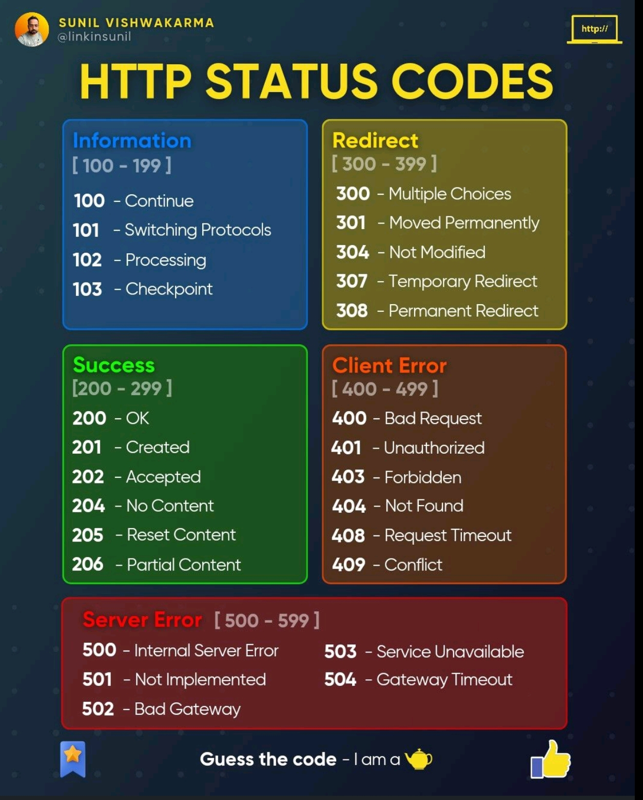

 

                

                
Table of contents                

                
{: .text-delta }                
1. TOC                
{:toc}                

 

---

<link rel="modulepreload" href="/assets/js/imageLoader.js">

---

# Status Codes

---

# HTTP Request Methods

## Most Common

<table class="table table-bordered"><tbody><tr><th>Method</th><th>Action</th></tr><tr><td><a href="/Article/HttpGet">GET</a></td><td>Retrieve information from the server. Should not modify the data on the server.
It can be cached, bookmarked,
and may remain in the browser history.</td></tr><tr><td><a href="/Article/HttpHead">HEAD</a></td><td>Similar to GET, except it transfers the status line and headers only. Should not modify the data on the server.
It cannot be bookmarked
and does not remain in the browser history.</td></tr><tr><td><a href="/Article/HttpPost">POST</a></td><td>Send data to the server, including images, JSON strings, file downloads, etc. It cannot be cached, bookmarked,
and not stored in the browser history.</td></tr><tr><td><a href="/Article/HttpPut">PUT</a></td><td>Replace or update an existing resource on the server. May change server status.
It cannot be cached, bookmarked,
and not stored in browser history.</td></tr><tr><td><a href="/Article/HttpPatch">PATCH</a></td><td>Partially modify the specified resource on the server. It is faster and requires less resources than the PUT method.
It cannot be cached, bookmarked,
and not stored in browser history.</td></tr><tr><td><a href="/Article/HttpDelete">DELETE</a></td><td>Delete a resource from the server. May change server status.
It cannot be cached, bookmarked,
and not stored in browser history.</td></tr><tr><td><a href="/Article/HttpOptions">OPTIONS</a></td><td>Used by browsers for CORS operations.
Describes the communication options available for the requested resource.
Does not change data on the server.
It cannot be cached, bookmarked,
and not stored in browser history.</td></tr><tr><td><a href="/Article/HttpConnect">CONNECT</a></td><td>Establishes two-way communication with the server
by creating an HTTP tunnel through a proxy server.</td></tr><tr><td><a href="/Article/HttpTrace">TRACE</a></td><td>It is designed for diagnostic purposes. When used, the web server sends back to the client the exact request that was received.</td></tr></tbody></table>

---

## ALL Verbs

| value             |                                                                                                                                                                                                                                                                                                                                                                                description                                                                                                                                                                                                                                                                                                                                                                                | documentation                                                                         | specification                                                          | spec-name                                      |
|-------------------|:-------------------------------------------------------------------------------------------------------------------------------------------------------------------------------------------------------------------------------------------------------------------------------------------------------------------------------------------------------------------------------------------------------------------------------------------------------------------------------------------------------------------------------------------------------------------------------------------------------------------------------------------------------------------------------------------------------------------------------------------------------------------------:|---------------------------------------------------------------------------------------|------------------------------------------------------------------------|------------------------------------------------|
| ACL               |                                                                                                                                                                                                                                                                         The ACL method modifies the access control list (which can be read via the DAV:acl property) of a resource. Specifically, the ACL method only permits modification to ACEs that are not inherited, and are not protected.                                                                                                                                                                                                                                                                         | https://datatracker.ietf.org/doc/html/rfc3744#section-8.1                             | http://webconcepts.info/specs/IETF/RFC/3744                            | RFC 3744                                       |
| BASELINE-CONTROL  |                                                                                                                                                                                     A collection can be placed under baseline control with a BASELINE-CONTROL request. When a collection is placed under baseline control, the DAV:version-controlled-configuration property of the collection is set to identify a new version-controlled configuration. This version-controlled configuration can be checked out and then checked in to create a new baseline for that collection.                                                                                                                                                                                      | https://datatracker.ietf.org/doc/html/rfc3253#section-12.6                            | http://webconcepts.info/specs/IETF/RFC/3253                            | RFC 3253                                       |
| BIND              |                                                                                                                                                                                                                                                                                          The BIND method modifies the collection identified by the Request-URI, by adding a new binding from the segment specified in the BIND body to the resource identified in the BIND body.                                                                                                                                                                                                                                                                                          | https://datatracker.ietf.org/doc/html/rfc5842#section-4                               | http://webconcepts.info/specs/IETF/RFC/5842                            | RFC 5842                                       |
| CHECKIN           |                                                                                                                                                                                                                                                                                            A CHECKIN request can be applied to a checked-out version-controlled resource to produce a new version whose content and dead properties are copied from the checked-out resource.                                                                                                                                                                                                                                                                                             | https://datatracker.ietf.org/doc/html/rfc3253#section-4.4                             | http://webconcepts.info/specs/IETF/RFC/3253                            | RFC 3253                                       |
| CHECKOUT          |                                                                                                                                                                                                                                                                                               A CHECKOUT request can be applied to a checked-in version-controlled resource to allow modifications to the content and dead properties of that version-controlled resource.                                                                                                                                                                                                                                                                                                | https://datatracker.ietf.org/doc/html/rfc3253#section-4.3                             | http://webconcepts.info/specs/IETF/RFC/3253                            | RFC 3253                                       |
| CONNECT           |                                                                                                                                                                The CONNECT method requests that the recipient establish a tunnel to the destination origin server identified by the request-target and, if successful, thereafter restrict its behavior to blind forwarding of packets, in both directions, until the tunnel is closed. Tunnels are commonly used to create an end-to-end virtual connection, through one or more proxies, which can then be secured using TLS (Transport Layer Security).                                                                                                                                                                | https://datatracker.ietf.org/doc/html/rfc7231#section-4.3.6                           | http://webconcepts.info/specs/IETF/RFC/7231                            | RFC 7231                                       |
| COPY              |                                                                                                                                                                                                                                     The COPY method creates a duplicate of the source resource identified by the Request-URI, in the destination resource identified by the URI in the Destination header. The Destination header MUST be present. The exact behavior of the COPY method depends on the type of the source resource.                                                                                                                                                                                                                                      | https://datatracker.ietf.org/doc/html/rfc4918#section-9.8                             | http://webconcepts.info/specs/IETF/RFC/4918                            | RFC 4918                                       |
| DELETE            |                                                                                                                                                                                                       The DELETE method requests that the origin server remove the association between the target resource and its current functionality. In effect, this method is similar to the rm command in UNIX: it expresses a deletion operation on the URI mapping of the origin server rather than an expectation that the previously associated information be deleted.                                                                                                                                                                                                        | https://datatracker.ietf.org/doc/html/rfc7231#section-4.3.5                           | http://webconcepts.info/specs/IETF/RFC/7231                            | RFC 7231                                       |
| GET               |                                                                                                                                                                                                             The GET method requests transfer of a current selected representation for the target resource. GET is the primary mechanism of information retrieval and the focus of almost all performance optimizations. Hence, when people speak of retrieving some identifiable information via HTTP, they are generally referring to making a GET request.                                                                                                                                                                                                              | https://datatracker.ietf.org/doc/html/rfc7231#section-4.3.1                           | http://webconcepts.info/specs/IETF/RFC/7231                            | RFC 7231                                       |
| HEAD              |                                                                                    The HEAD method is identical to GET except that the server MUST NOT send a message body in the response (i.e., the response terminates at the end of the header section). The server SHOULD send the same header fields in response to a HEAD request as it would have sent if the request had been a GET, except that the payload header fields MAY be omitted. This method can be used for obtaining metadata about the selected representation without transferring the representation data and is often used for testing hypertext links for validity, accessibility, and recent modification.                                                                                     | https://datatracker.ietf.org/doc/html/rfc7231#section-4.3.2                           | http://webconcepts.info/specs/IETF/RFC/7231                            | RFC 7231                                       |
| LABEL             |                                                                                                                                                                                                                  A LABEL request can be applied to a version to modify the labels that select that version. The case of a label name MUST be preserved when it is stored and retrieved. When comparing two label names to decide if they match or not, a server SHOULD use a case-sensitive URL-escaped UTF-8 encoded comparison of the two label names.                                                                                                                                                                                                                  | https://datatracker.ietf.org/doc/html/rfc3253#section-8.2                             | http://webconcepts.info/specs/IETF/RFC/3253                            | RFC 3253                                       |
| LINK              |                                                                                                                                                                                                                                                                                                       The LINK method is used to establish one or more relationships between the resource identified by the effective request URI and one or more other resources.                                                                                                                                                                                                                                                                                                        | https://datatracker.ietf.org/doc/html/draft-snell-link-method#section-3               | http://webconcepts.info/specs/IETF/I-D/snell-link-method               | Internet Draft snell-link-method               |
| LOCK              |                                                                                                                                                                                                                                                                                                                                      The LOCK method is used to take out a lock of any access type and to refresh an existing lock.                                                                                                                                                                                                                                                                                                                                       | https://datatracker.ietf.org/doc/html/rfc4918#section-9.10                            | http://webconcepts.info/specs/IETF/RFC/4918                            | RFC 4918                                       |
| MERGE             |                                                                                                                                                           The MERGE method performs the logical merge of a specified version (the "merge source") into a specified version-controlled resource (the "merge target"). If the merge source is neither an ancestor nor a descendant of the DAV:checked-in or DAV:checked-out version of the merge target, the MERGE checks out the merge target (if it is not already checked out) and adds the URL of the merge source to the DAV:merge-set of the merge target.                                                                                                                                                            | https://datatracker.ietf.org/doc/html/rfc3253#section-11.2                            | http://webconcepts.info/specs/IETF/RFC/3253                            | RFC 3253                                       |
| MKACTIVITY        |                                                                                                                                                                                                                                                                 A MKACTIVITY request creates a new activity resource. A server MAY restrict activity creation to particular collections, but a client can determine the location of these collections from a DAV:activity-collection-set OPTIONS request.                                                                                                                                                                                                                                                                 | https://datatracker.ietf.org/doc/html/rfc3253#section-13.5                            | http://webconcepts.info/specs/IETF/RFC/3253                            | RFC 3253                                       |
| MKCALENDAR        |                                                                                                                                                                                                                                                                                                   An HTTP request using the MKCALENDAR method creates a new calendar collection resource. A server MAY restrict calendar collection creation to particular collections.                                                                                                                                                                                                                                                                                                   | https://datatracker.ietf.org/doc/html/rfc4791#section-5.3.1                           | http://webconcepts.info/specs/IETF/RFC/4791                            | RFC 4791                                       |
| MKCOL             |                                                                                                                          MKCOL creates a new collection resource at the location specified by the Request-URI. If the Request-URI is already mapped to a resource, then the MKCOL MUST fail. During MKCOL processing, a server MUST make the Request-URI an internal member of its parent collection, unless the Request-URI is "/". If no such ancestor exists, the method MUST fail. When the MKCOL operation creates a new collection resource, all ancestors MUST already exist, or the method MUST fail with a 409 (Conflict) status code.                                                                                                                           | https://datatracker.ietf.org/doc/html/rfc4918#section-9.3                             | http://webconcepts.info/specs/IETF/RFC/4918                            | RFC 4918                                       |
| MKREDIRECTREF     |                                                                                                                                                                                                                                                                                                                                             The MKREDIRECTREF method requests the creation of a redirect reference resource.                                                                                                                                                                                                                                                                                                                                              | https://datatracker.ietf.org/doc/html/rfc4437#section-6                               | http://webconcepts.info/specs/IETF/RFC/4437                            | RFC 4437                                       |
| MKWORKSPACE       |                                                                                                                                                                                                                                                               A MKWORKSPACE request creates a new workspace resource. A server MAY restrict workspace creation to particular collections, but a client can determine the location of these collections from a DAV:workspace-collection-set OPTIONS request.                                                                                                                                                                                                                                                               | https://datatracker.ietf.org/doc/html/rfc3253#section-6.3                             | http://webconcepts.info/specs/IETF/RFC/3253                            | RFC 3253                                       |
| MOVE              |                                                                                                                                                The MOVE operation on a non-collection resource is the logical equivalent of a copy (COPY), followed by consistency maintenance processing, followed by a delete of the source, where all three actions are performed in a single operation. The consistency maintenance step allows the server to perform updates caused by the move, such as updating all URLs, other than the Request-URI that identifies the source resource, to point to the new destination resource.                                                                                                                                                | https://datatracker.ietf.org/doc/html/rfc4918#section-9.9                             | http://webconcepts.info/specs/IETF/RFC/4918                            | RFC 4918                                       |
| OPTIONS           |                                                                                                                                                                                                             The OPTIONS method requests information about the communication options available for the target resource, at either the origin server or an intervening intermediary. This method allows a client to determine the options and/or requirements associated with a resource, or the capabilities of a server, without implying a resource action.                                                                                                                                                                                                              | https://datatracker.ietf.org/doc/html/rfc7231#section-4.3.7                           | http://webconcepts.info/specs/IETF/RFC/7231                            | RFC 7231                                       |
| ORDERPATCH        |                                                                                                                                                                                                                                                                                                         The ORDERPATCH method is used to change the ordering semantics of a collection, to change the order of the collection's members in the ordering, or both.                                                                                                                                                                                                                                                                                                         | https://datatracker.ietf.org/doc/html/rfc3648#section-7                               | http://webconcepts.info/specs/IETF/RFC/3648                            | RFC 3648                                       |
| PATCH             |                                                                                                                                                        The PATCH method requests that a set of changes described in the request entity be applied to the resource identified by the Request-URI. The set of changes is represented in a format called a "patch document" identified by a media type. If the Request-URI does not point to an existing resource, the server MAY create a new resource, depending on the patch document type (whether it can logically modify a null resource) and permissions, etc.                                                                                                                                                        | https://datatracker.ietf.org/doc/html/rfc5789#section-2                               | http://webconcepts.info/specs/IETF/RFC/5789                            | RFC 5789                                       |
| POST              |                                                                                                                                                                                                                                                                                                         The POST method requests that the target resource process the representation enclosed in the request according to the resource's own specific semantics.                                                                                                                                                                                                                                                                                                          | https://datatracker.ietf.org/doc/html/rfc7231#section-4.3.3                           | http://webconcepts.info/specs/IETF/RFC/7231                            | RFC 7231                                       |
| PRI               |                                                                                                                                                                                                                                                                                                 This method is never used by an actual client. This method will appear to be used when an HTTP/1.1 server or intermediary attempts to parse an HTTP/2 connection preface.                                                                                                                                                                                                                                                                                                 | https://datatracker.ietf.org/doc/html/rfc7540#section-3.5                             | http://webconcepts.info/specs/IETF/RFC/7540                            | RFC 7540                                       |
| PROPFIND          |                                                                                                                                                                                                                                 The PROPFIND method retrieves properties defined on the resource identified by the Request-URI, if the resource does not have any internal members, or on the resource identified by the Request-URI and potentially its member resources, if the resource is a collection that has internal member URLs.                                                                                                                                                                                                                                 | https://datatracker.ietf.org/doc/html/rfc4918#section-9.1                             | http://webconcepts.info/specs/IETF/RFC/4918                            | RFC 4918                                       |
| PROPPATCH         |                                                                                                                                                                                                                                                                                                     The PROPPATCH method processes instructions specified in the request body to set and/or remove properties defined on the resource identified by the Request-URI.                                                                                                                                                                                                                                                                                                      | https://datatracker.ietf.org/doc/html/rfc4918#section-9.2                             | http://webconcepts.info/specs/IETF/RFC/4918                            | RFC 4918                                       |
| PUT               | The PUT method requests that the state of the target resource be created or replaced with the state defined by the representation enclosed in the request message payload. A successful PUT of a given representation would suggest that a subsequent GET on that same target resource will result in an equivalent representation being sent in a 200 (OK) response. However, there is no guarantee that such a state change will be observable, since the target resource might be acted upon by other user agents in parallel, or might be subject to dynamic processing by the origin server, before any subsequent GET is received. A successful response only implies that the user agent's intent was achieved at the time of its processing by the origin server. | https://datatracker.ietf.org/doc/html/rfc7231#section-4.3.4                           | http://webconcepts.info/specs/IETF/RFC/7231                            | RFC 7231                                       |
| QUERY             |                                                                                                                               The QUERY method is used to initiate a server-side query. Unlike the HTTP GET method, which requests that a server return a representation of the resource identified by the target URI, the QUERY method is used to ask the server to perform a query operation (described by the request payload) over some set of data scoped to the effective request URI. The payload returned in response to a QUERY cannot be assumed to be a representation of the resource identified by the effective request URI.                                                                                                                                | https://datatracker.ietf.org/doc/html/draft-ietf-httpbis-safe-method-w-body#section-2 | http://webconcepts.info/specs/IETF/I-D/ietf-httpbis-safe-method-w-body | Internet Draft ietf-httpbis-safe-method-w-body |
| REBIND            |                                                                                                                                                                            The REBIND method removes a binding to a resource from a collection, and adds a binding to that resource into the collection identified by the Request-URI. The request body specifies the binding to be added (segment) and the old binding to be removed (href). It is effectively an atomic form of a MOVE request, and MUST be treated the same way as MOVE for the purpose of determining access permissions.                                                                                                                                                                             | https://datatracker.ietf.org/doc/html/rfc5842#section-6                               | http://webconcepts.info/specs/IETF/RFC/5842                            | RFC 5842                                       |
| REPORT            |                                                                                                                                                                                                                                             A REPORT request is an extensible mechanism for obtaining information about a resource. Unlike a resource property, which has a single value, the value of a report can depend on additional information specified in the REPORT request body and in the REPORT request headers.                                                                                                                                                                                                                                              | https://datatracker.ietf.org/doc/html/rfc3253#section-3.6                             | http://webconcepts.info/specs/IETF/RFC/3253                            | RFC 3253                                       |
| SEARCH            |                                                                                                                                                                                                                                                                                         The client invokes the SEARCH method to initiate a server-side search. The body of the request defines the query. The server MUST emit an entity matching the WebDAV multistatus format.                                                                                                                                                                                                                                                                                          | https://datatracker.ietf.org/doc/html/rfc5323#section-2                               | http://webconcepts.info/specs/IETF/RFC/5323                            | RFC 5323                                       |
| TRACE             |                                                                                                                                                                The TRACE method requests a remote, application-level loop-back of the request message. The final recipient of the request SHOULD reflect the message received, excluding some fields described below, back to the client as the message body of a 200 (OK) response with a Content-Type of "message/http". The final recipient is either the origin server or the first server to receive a Max-Forwards value of zero (0) in the request.                                                                                                                                                                | https://datatracker.ietf.org/doc/html/rfc7231#section-4.3.8                           | http://webconcepts.info/specs/IETF/RFC/7231                            | RFC 7231                                       |
| UNBIND            |                                                                                                                                                                                                                                                                                                          The UNBIND method modifies the collection identified by the Request-URI by removing the binding identified by the segment specified in the UNBIND body.                                                                                                                                                                                                                                                                                                          | https://datatracker.ietf.org/doc/html/rfc5842#section-5                               | http://webconcepts.info/specs/IETF/RFC/5842                            | RFC 5842                                       |
| UNCHECKOUT        |                                                                                                                                                                                                                                                                                              An UNCHECKOUT request can be applied to a checked-out version-controlled resource to cancel the CHECKOUT and restore the pre-CHECKOUT state of the version-controlled resource.                                                                                                                                                                                                                                                                                              | https://datatracker.ietf.org/doc/html/rfc3253#section-4.5                             | http://webconcepts.info/specs/IETF/RFC/3253                            | RFC 3253                                       |
| UNLINK            |                                                                                                                                                                                                                                                                                                              The UNLINK method is used to remove one or more relationships between the resource identified by the effective request URI and other resources.                                                                                                                                                                                                                                                                                                              | https://datatracker.ietf.org/doc/html/draft-snell-link-method#section-4               | http://webconcepts.info/specs/IETF/I-D/snell-link-method               | Internet Draft snell-link-method               |
| UNLOCK            |                                                                                                                                                                                                                                                                                                 The UNLOCK method removes the lock identified by the lock token in the Lock-Token request header. The Request-URI MUST identify a resource within the scope of the lock.                                                                                                                                                                                                                                                                                                  | https://datatracker.ietf.org/doc/html/rfc4918#section-9.11                            | http://webconcepts.info/specs/IETF/RFC/4918                            | RFC 4918                                       |
| UPDATE            |                                                                                                                                                                                                                                                            The UPDATE method modifies the content and dead properties of a checked-in version-controlled resource (the "update target") to be those of a specified version (the "update source") from the version history of that version-controlled resource.                                                                                                                                                                                                                                                            | https://datatracker.ietf.org/doc/html/rfc3253#section-7.1                             | http://webconcepts.info/specs/IETF/RFC/3253                            | RFC 3253                                       |
| UPDATEREDIRECTREF |                                                                                                                                                                                                                                                                                                                                            The UPDATEREDIRECTREF method requests the update of a redirect reference resource.                                                                                                                                                                                                                                                                                                                                             | https://datatracker.ietf.org/doc/html/rfc4437#section-7                               | http://webconcepts.info/specs/IETF/RFC/4437                            | RFC 4437                                       |
| VERSION-CONTROL   |                                                                                                                                                                                                                                                                                            A VERSION-CONTROL request can be used to create a version-controlled resource at the request-URL. It can be applied to a versionable resource or to a version-controlled resource.                                                                                                                                                                                                                                                                                             | https://datatracker.ietf.org/doc/html/rfc3253#section-3.5                             | http://webconcepts.info/specs/IETF/RFC/3253                            | RFC 3253                                       |