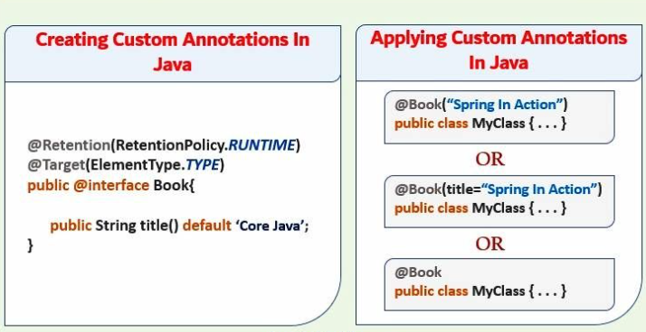

           

                

                
Table of contents                

                
{: .text-delta }                
1. TOC                
{:toc}                

                

                 

***                

 

# Create Custom Annotation

