<br/>            

<details markdown="block">                  
<summary>                  
Table of contents                  
</summary>                  
{: .text-delta }                  
1. TOC                  
{:toc}                  
</details>                  

<br/>                  

***                  

<br/>                  

# Optionals

```java            
public class OptEx {
    Optional<Map<String, String>> aorMap = Optional.ofNullable(this.customAORMap);

}
```            

# Streams

## Map and Collect

```java            

public class MapExample {

    Map newMap = clientEntityMap.entrySet().stream().collect(Collectors.toMap(Map.Entry::getKey, entry -> entry.getValue().stream().map(e -> {
        String externalCode = e.getDescription();
        String externalCode = e.getDescription();
        String externalCode = e.getDescription();

        return Map.of("externalCode", "");
    }).collect(Collectors.toList())));
}          
```            

## ConcurrentHashMap and LinkedList

```java  
public class LinkedListEx {
    Map newMap = this.clientEntityMap.entrySet().stream().map(entry -> Map.entry(entry.getKey(), entry.getValue().stream().map(ClientEntityDetails::toMap).collect(Collectors.toCollection(LinkedList::new)))).collect(Collectors.toConcurrentMap(Map.Entry::getKey, Map.Entry::getValue, (a, b) -> b, ConcurrentHashMap::new));

}          
```            

## Map to String

```java            
public class MapToString {
    Map mapToString = this.clientEntityMap.entrySet().stream().map(entry -> Map.entry(entry.getKey(), entry.getValue().stream().map(ClientEntityDetails::toMap).collect(Collectors.toCollection(LinkedList::new)))).collect(Collectors.toConcurrentMap(Map.Entry::getKey, Map.Entry::getValue, (a, b) -> b, ConcurrentHashMap::new));

}         
```

# Sealed Classes

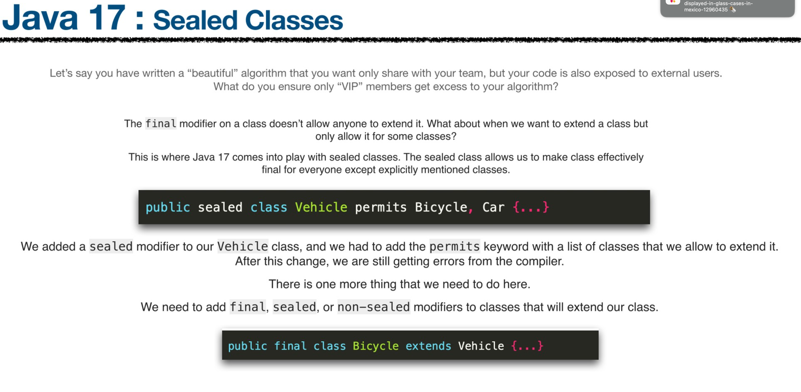

# Pattern Matching

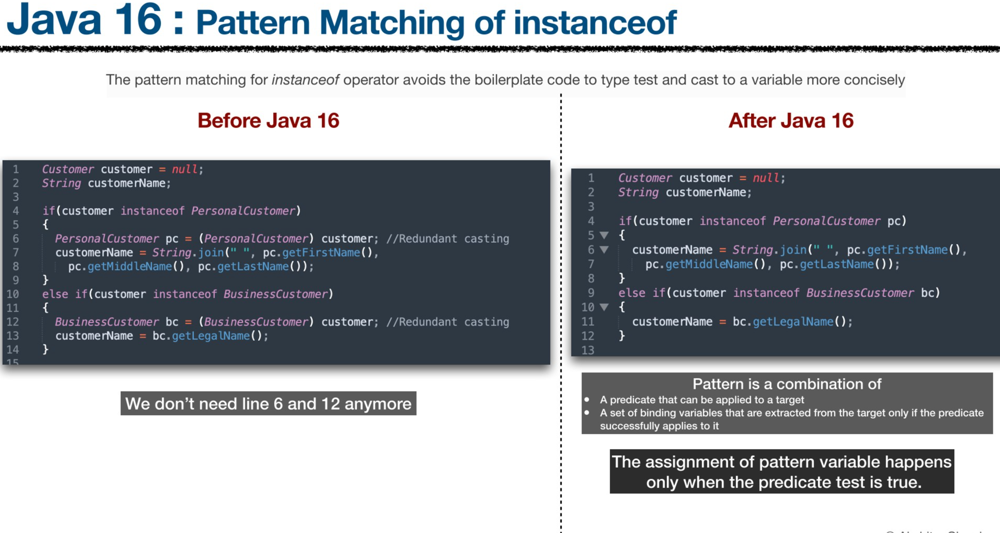

## Scope of Variables

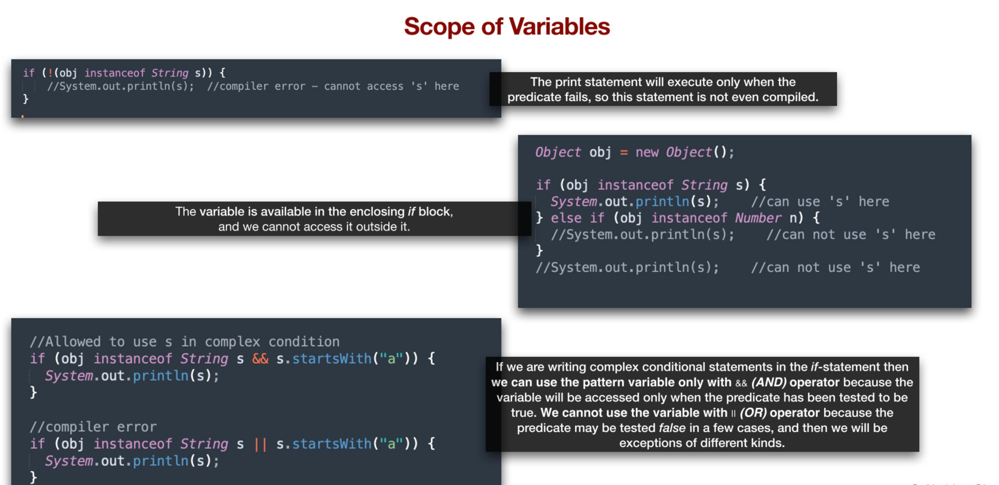

# Records

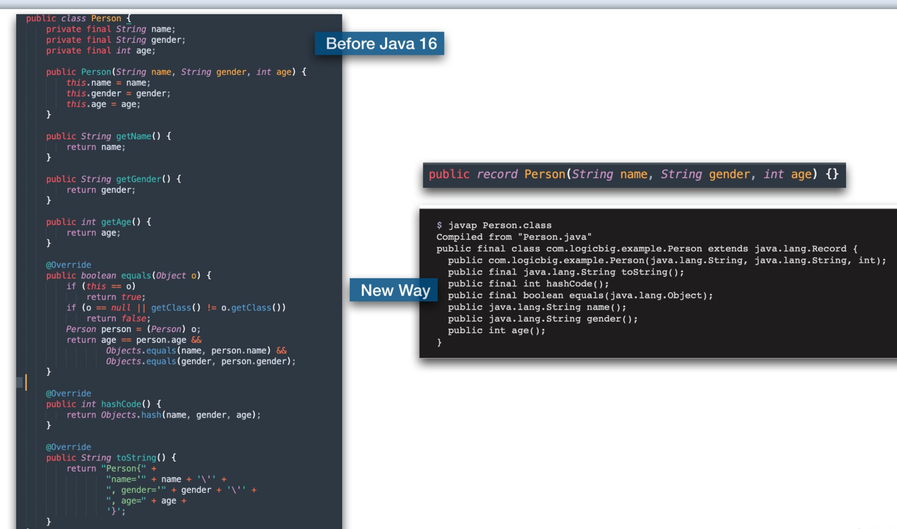

# Text Block (String)

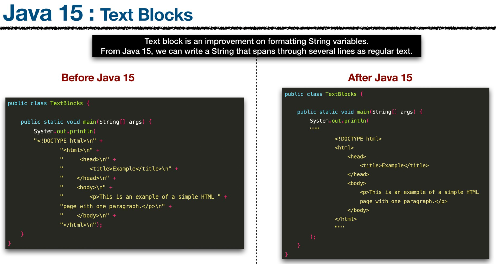
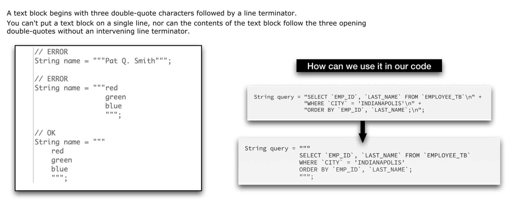

# Switch (Case)

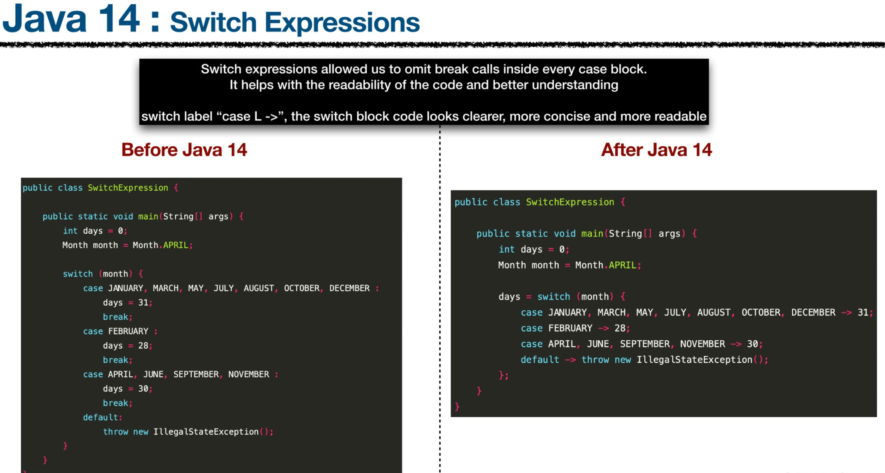
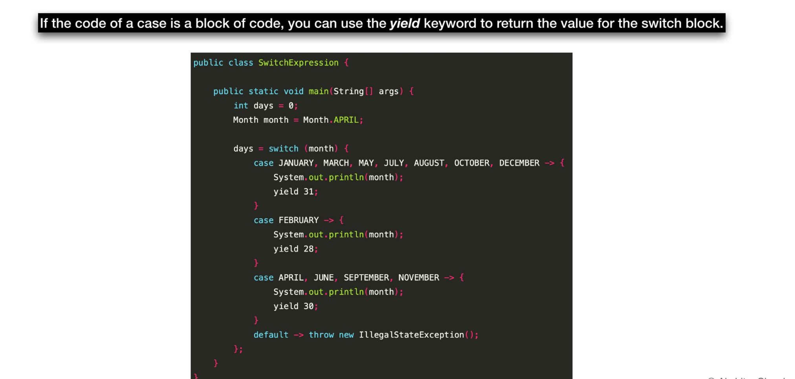

# Local Variable Type Interface (Var)

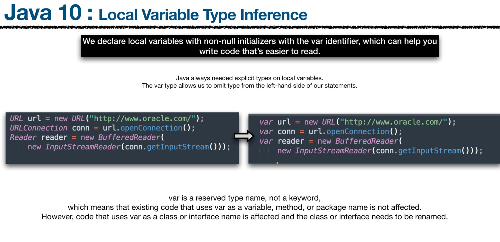

## var with lambda

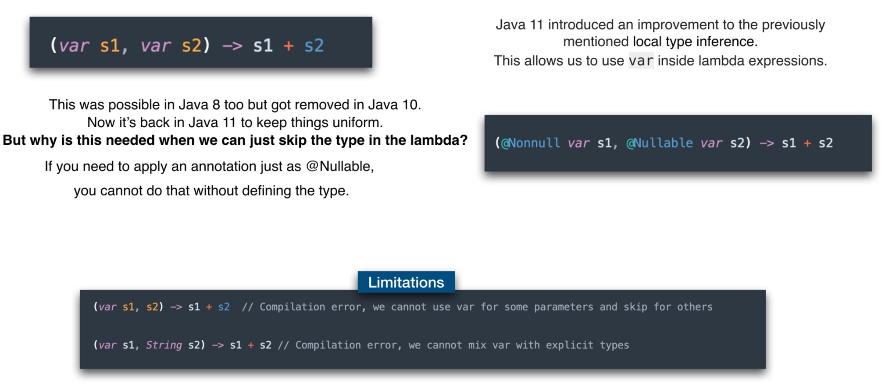

# Private Interface Methods

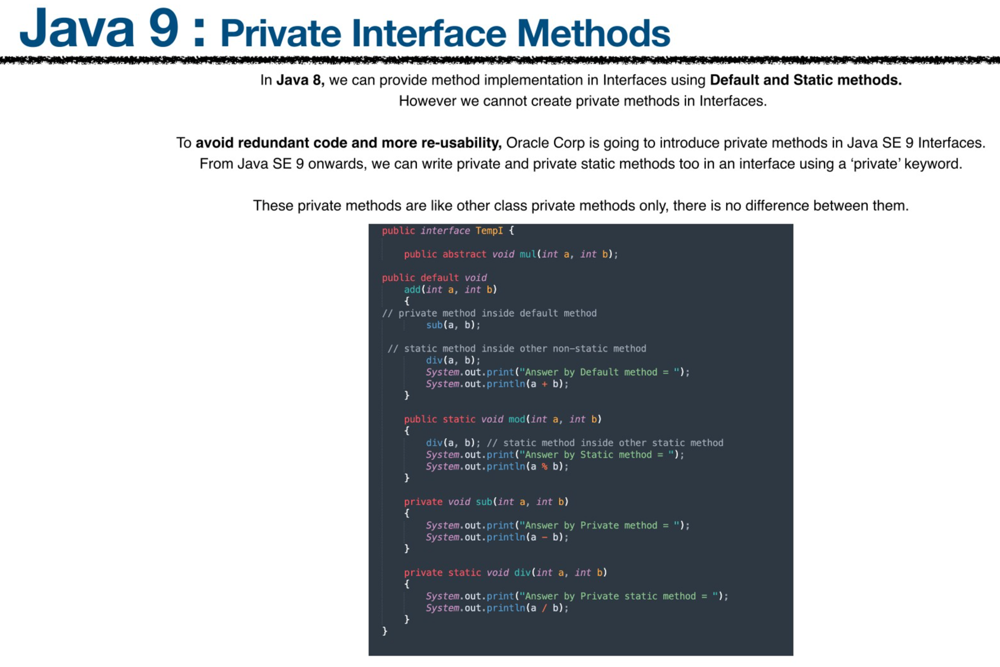

# Try

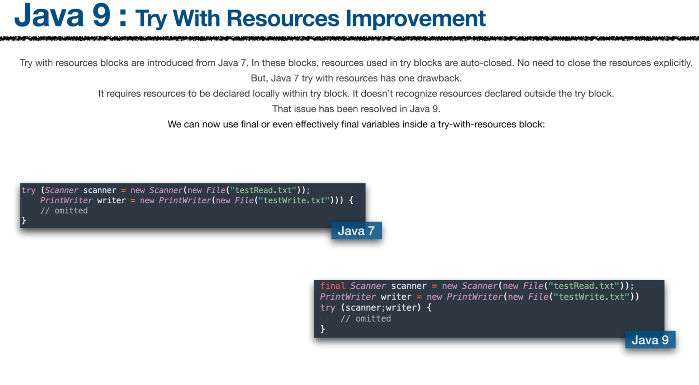

# Diamond Operator

## For Anonymous Inner Class

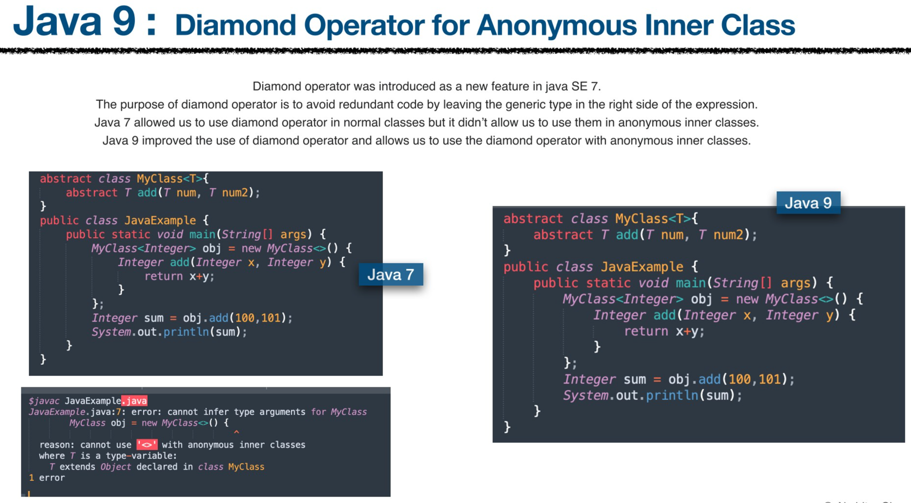