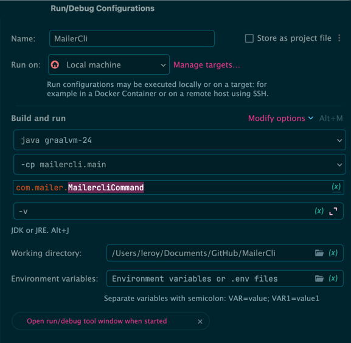
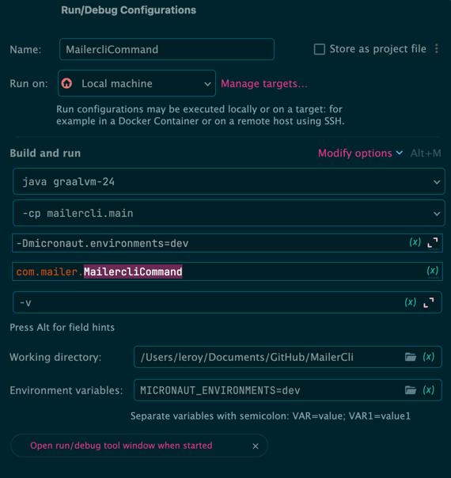

<br/>          

<details markdown="block">                
<summary>                
Table of contents                
</summary>                
{: .text-delta }                
1. TOC                
{:toc}                
</details>                

<br/>                

***                

<br/>

# Run

## From Jar
  ```shell
    java -jar build/libs/mailercli-0.1-all.jar "cotdc.com"
  ```

## From Native File
  ```shell
    ./build/native/nativeCompile/mailercli cotdc.com
  ```
# Debug

## Gradle

- `:run -Dmicronaut.environments=dev`

```shell
./gradlew run \
  -Dmicronaut.environments=dev \
  -Dorg.gradle.jvmargs="-agentlib:jdwp=transport=dt_socket,server=y,suspend=n,address=*:5005"
```

## Application Run/Debug Template



## Micronaut Run/Debug Template

