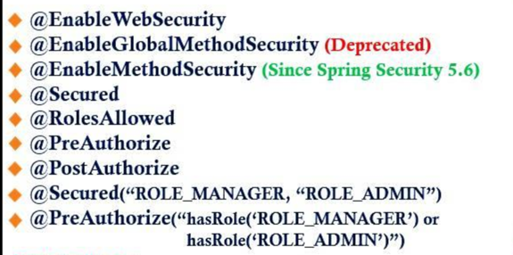

 

                

                
Table of contents                

                
{: .text-delta }                
1. TOC                
{:toc}                

 

---

 

# Web

# Security

